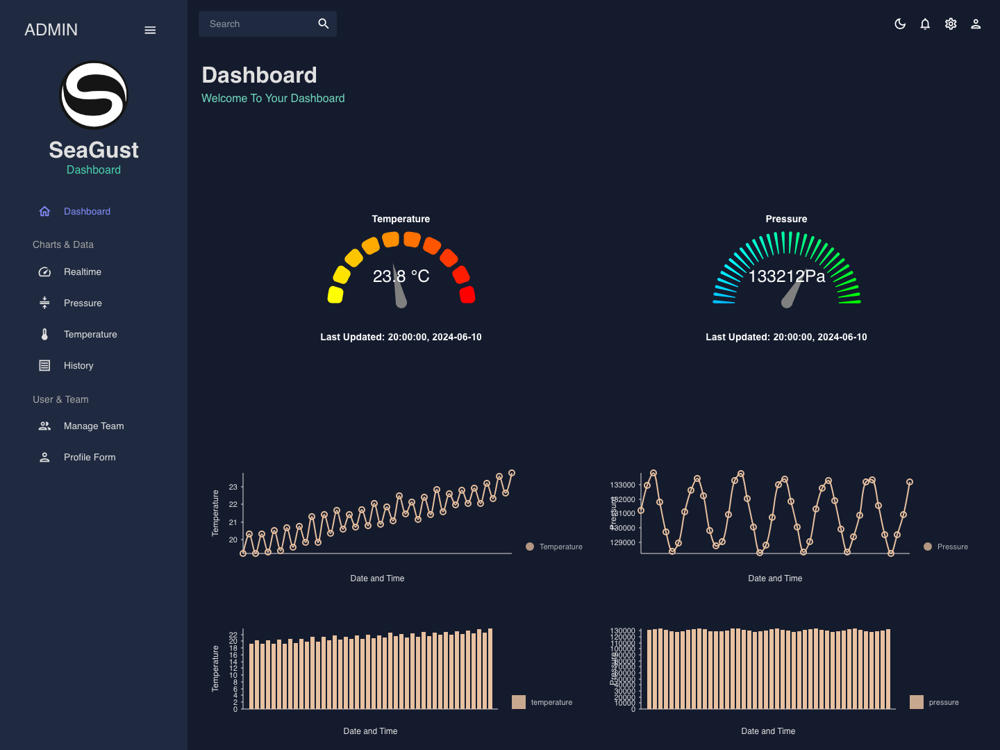
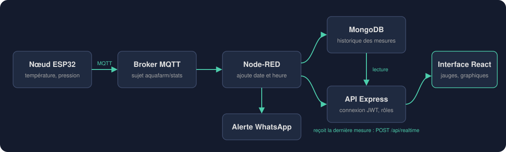
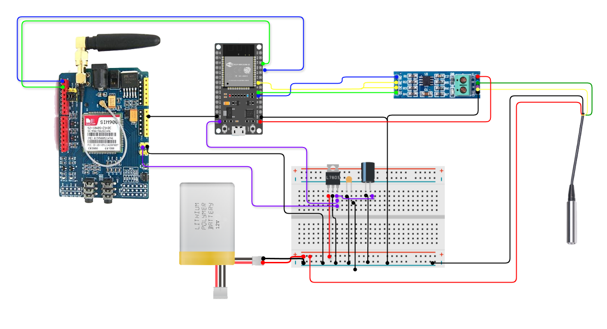
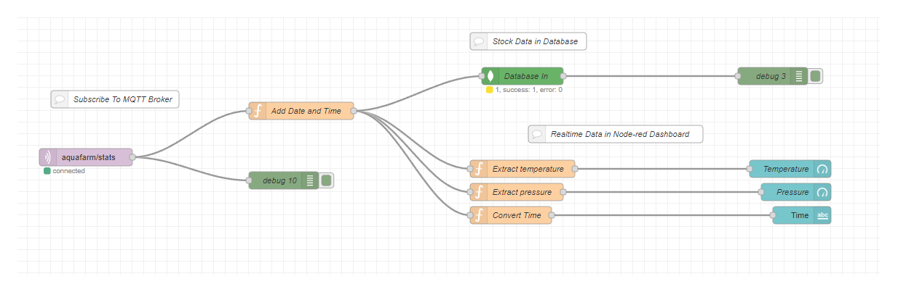
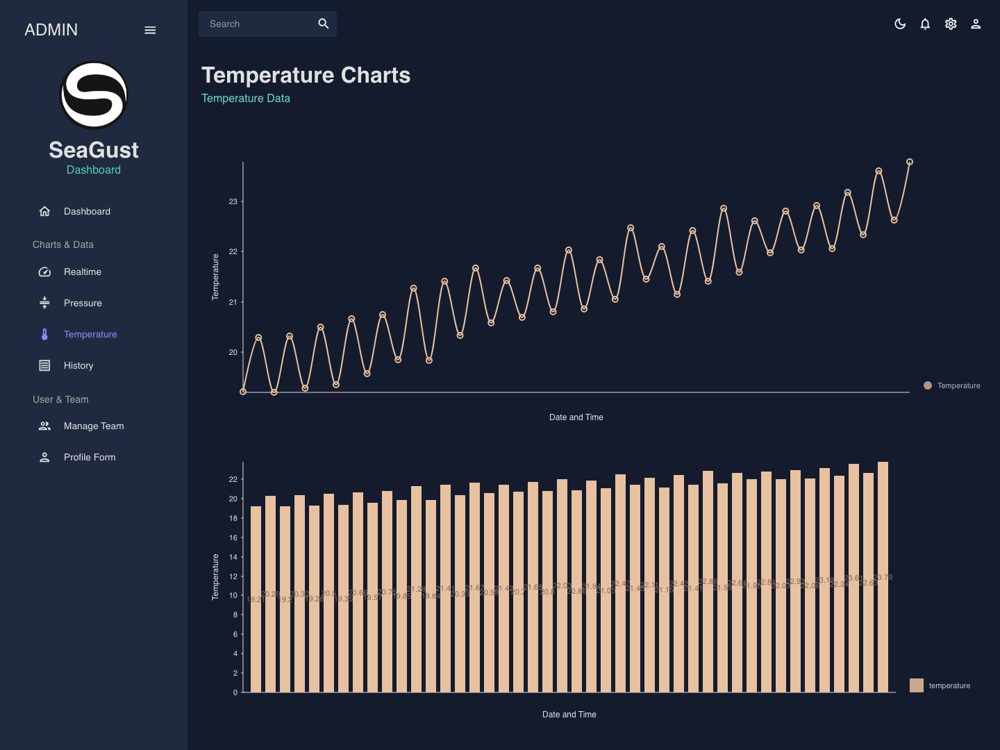
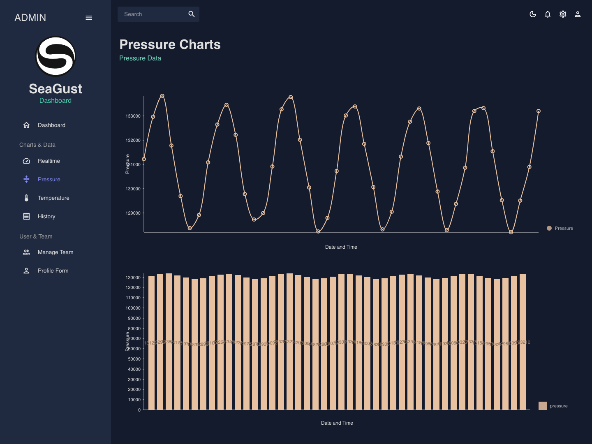
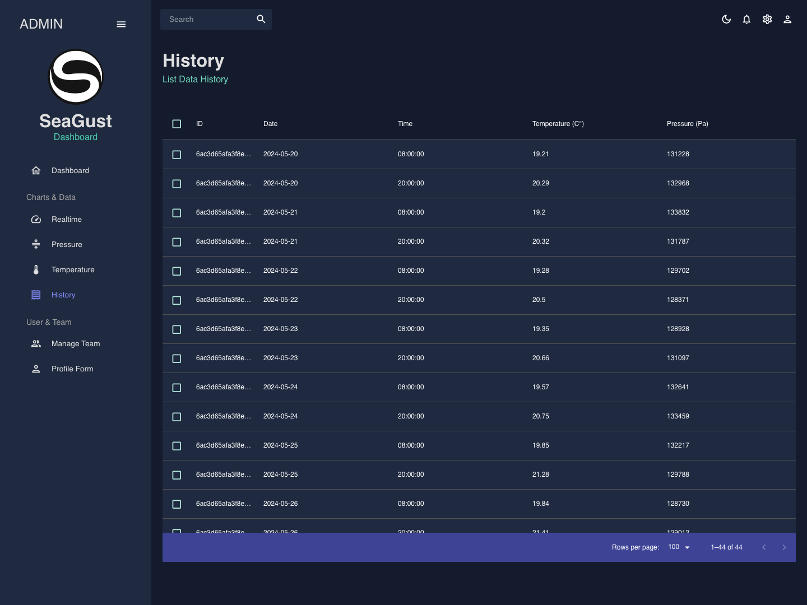
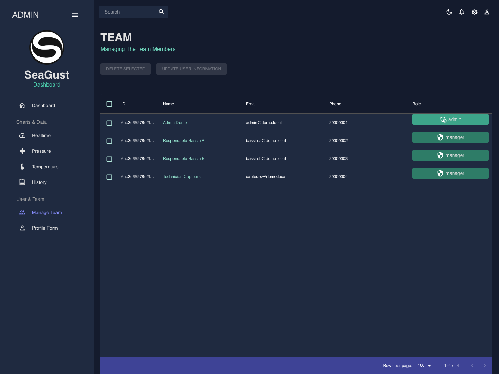
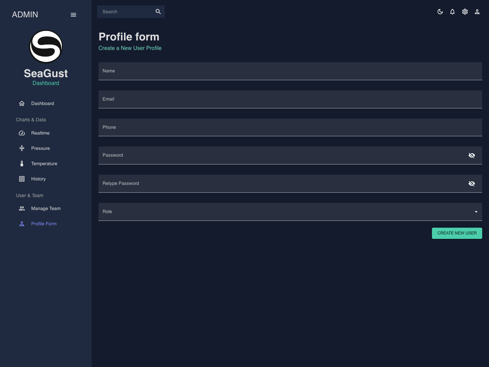
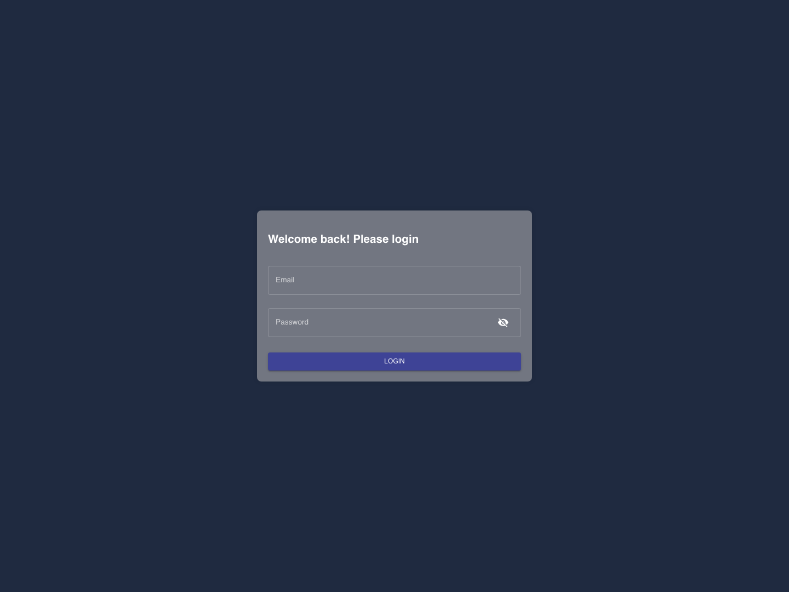

# Système de suivi d'une ferme aquacole

Un système IoT complet : un capteur immergé mesure la température et la pression de l'eau, un nœud ESP32 envoie les mesures par le réseau mobile, et ce tableau de bord les affiche en direct.

Ce dépôt contient **le tableau de bord et son API**.



> Projet de fin d'études (licence en informatique, spécialité systèmes embarqués et IoT, Faculté des Sciences de Bizerte), réalisé en binôme chez SeaGust de février à juin 2024.

## Le problème

Dans une ferme aquacole, la qualité de l'eau décide de la santé des poissons. La température, la pression, le pH ou la salinité changent avec la météo, les saisons et l'alimentation.

Le suivi classique se fait à la main : sondes et analyses en laboratoire. C'est lent, coûteux, sujet aux erreurs, et surtout **sans donnée en temps réel** pour décider vite.

## La solution

- Un **nœud autonome** posé sur la cage en mer, qui mesure à intervalle régulier, sans intervention humaine.
- Une **transmission par le réseau mobile** (GSM/GPRS), adaptée à une cage en mer.
- Un **tableau de bord** simple, consultable à distance par l'équipe.

## Architecture



Le trajet d'une mesure :

1. Le **capteur PL309** mesure la pression et la température. L'ESP32 le lit en **Modbus RTU**, à travers un convertisseur RS485.
2. L'**ESP32** met la mesure au format JSON. Le module **SIM900** l'envoie par GPRS au broker **Mosquitto**, en MQTT.
3. **Node-RED** reçoit le message, ajoute la date et l'heure, l'enregistre dans **MongoDB** et pousse la dernière mesure à l'API. Si un seuil est dépassé, il envoie une alerte WhatsApp.
4. L'**API Express** sert l'historique, la dernière mesure et les comptes.
5. L'**interface React** affiche les jauges, les graphiques et les tableaux.

Les deux autres parties du système ont leur propre dépôt :

| Partie | Dépôt |
|---|---|
| Nœud ESP32, version de test : envoi de mesures simulées en MQTT (PlatformIO, C++) | [End-Node-Aquaculture-farm](https://github.com/Rythme19/End-Node-Aquaculture-farm) |
| Flux Node-RED | [Node-Red-Aquaculture-monitoring-system](https://github.com/Rythme19/Node-Red-Aquaculture-monitoring-system) |

## Le matériel



| Composant | Rôle |
|---|---|
| ESP32 | Lit le capteur, prépare le message et pilote l'envoi |
| Capteur PL309 | Sonde immergée en inox : pression et température, sortie RS485 |
| Convertisseur RS485 vers TTL | Fait le lien entre le signal du capteur et l'ESP32 |
| Module SIM900 | Connexion GSM/GPRS, pilotée par commandes AT |
| Batterie LiPo et régulateur 7805 | Alimentation stable en 5 V |

**Pourquoi le réseau mobile ?** LoRaWAN a été étudié en premier, puis écarté à cause de contraintes régionales. Le GSM/GPRS couvre la zone, coûte peu et se met en place simplement.

## Le traitement des mesures



Node-RED s'abonne au sujet `aquafarm/stats`, ajoute la date et l'heure à chaque message, puis l'enregistre dans MongoDB. Un petit tableau de contrôle Node-RED permet de vérifier que les mesures arrivent.

## Le tableau de bord

- **Suivi en direct** : deux jauges (température, pression), actualisées toutes les 5 secondes.
- **Graphiques** : courbe et histogramme pour chaque grandeur, avec le détail d'une mesure au survol.
- **Historique** : toutes les mesures dans un tableau, avec tri et filtre.
- **Comptes et rôles** : un administrateur crée les comptes, modifie les informations, change les rôles et supprime des utilisateurs. Un manager consulte les données.
- **Thème clair ou sombre**, au choix.

| Température | Pression |
|---|---|
|  |  |

| Historique des mesures | Gestion de l'équipe |
|---|---|
|  |  |

| Création d'un compte | Connexion |
|---|---|
|  |  |

Captures faites en local, avec des données de démonstration.

## Organisation du projet

Le projet a été mené en Scrum : 13 user stories réparties sur trois sprints de quatre semaines.

| Sprint | Objectif | Ce qui a été livré |
|---|---|---|
| 1 | Collecte et transmission | Câblage du nœud, lecture du capteur en Modbus RTU, envoi en MQTT par GPRS, Node-RED et MongoDB |
| 2 | Suivi des données | API, pages température et pression, jauges en direct, historique avec tri et filtre, alertes |
| 3 | Gestion des utilisateurs | Connexion, rôles admin et manager, création, modification et suppression des comptes |

Objectifs fixés au cahier des charges :

- afficher une nouvelle mesure en moins de 15 secondes ;
- charger un an d'historique en moins de 10 secondes ;
- accepter jusqu'à 10 capteurs en même temps ;
- une prise en main en moins de 10 minutes.

## Technologies

| Côté | Outils |
|---|---|
| Interface | React 18, Material UI, Nivo (graphiques), MobX, React Router, Formik et Yup |
| API | Node.js, Express, Mongoose, JWT, bcrypt |
| Données | MongoDB |
| Chaîne IoT | ESP32 (C++, PlatformIO), Modbus RTU, MQTT (Mosquitto), Node-RED |

## Lancer le projet

Il faut Node.js et une base MongoDB qui écoute sur `127.0.0.1:27017`.

**1. L'API** (port 3001)

```bash
cd server
npm install
PORT=3001 npm start
```

**2. L'interface** (port 3000)

```bash
cd client
npm install --legacy-peer-deps
npm start
```

**3. Le premier compte administrateur**

```bash
curl -X POST http://localhost:3001/api/role -H "Content-Type: application/json" -d '{"label":"admin"}'
curl -X POST http://localhost:3001/api/role -H "Content-Type: application/json" -d '{"label":"manager"}'
curl -X POST http://localhost:3001/api/user/register -H "Content-Type: application/json" \
  -d '{"name":"Admin","email":"admin@example.com","phone":20000000,"password":"VOTRE_MOT_DE_PASSE","role":"admin"}'
```

**4. Une mesure de test** (sans capteur ni Node-RED)

```bash
curl -X POST http://localhost:3001/api/realtime -H "Content-Type: application/json" \
  -d '{"date":"2024-06-10","time":"20:00:00","temperature":23.8,"pressure":133212}'
```

Ouvrir ensuite `http://localhost:3000` et se connecter.

## Routes de l'API

| Méthode | Route | Rôle |
|---|---|---|
| POST | `/api/user/login` | Connexion, renvoie un jeton JWT et le rôle |
| POST | `/api/user/register` | Création d'un compte |
| GET | `/api/user` | Liste des comptes |
| PUT | `/api/user/role` | Changement de rôle |
| PUT | `/api/user/:id` | Mise à jour d'un compte |
| DELETE | `/api/user` | Suppression de comptes |
| GET, POST | `/api/role` | Liste et ajout de rôles |
| GET | `/api/aquastats/getData` | Historique des mesures |
| GET, POST | `/api/realtime` | Dernières mesures reçues |

## Pistes d'amélioration

- Analyse prédictive sur l'historique des mesures.
- Sécurité des comptes : double authentification et réinitialisation du mot de passe.
- État des capteurs et notifications dans le tableau de bord.
- Choix de la ferme à suivre, pour gérer plusieurs sites.
